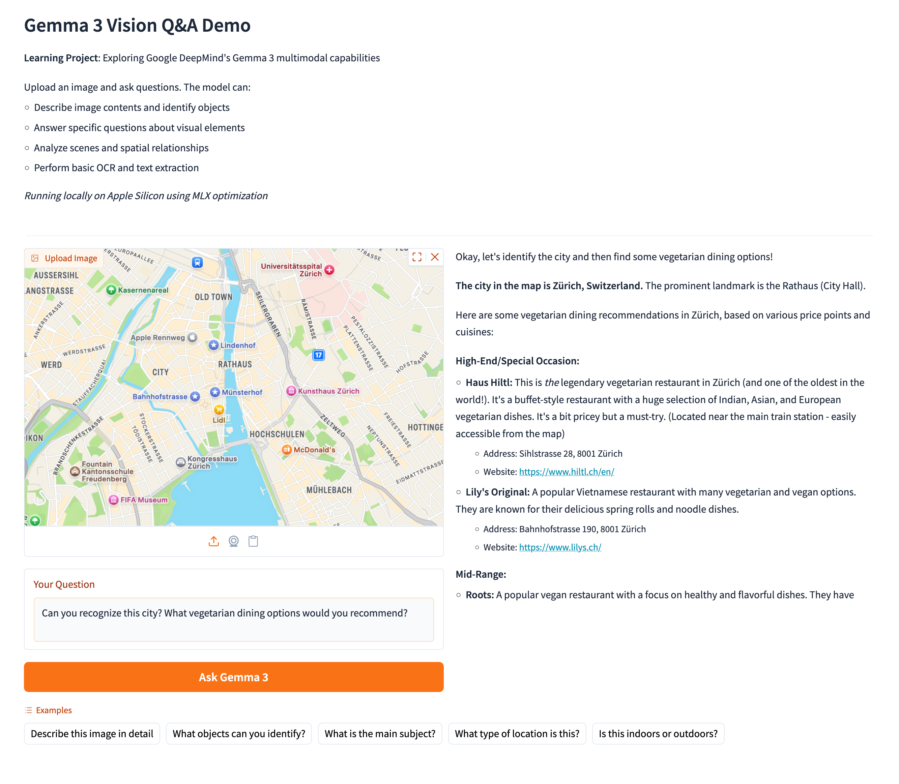
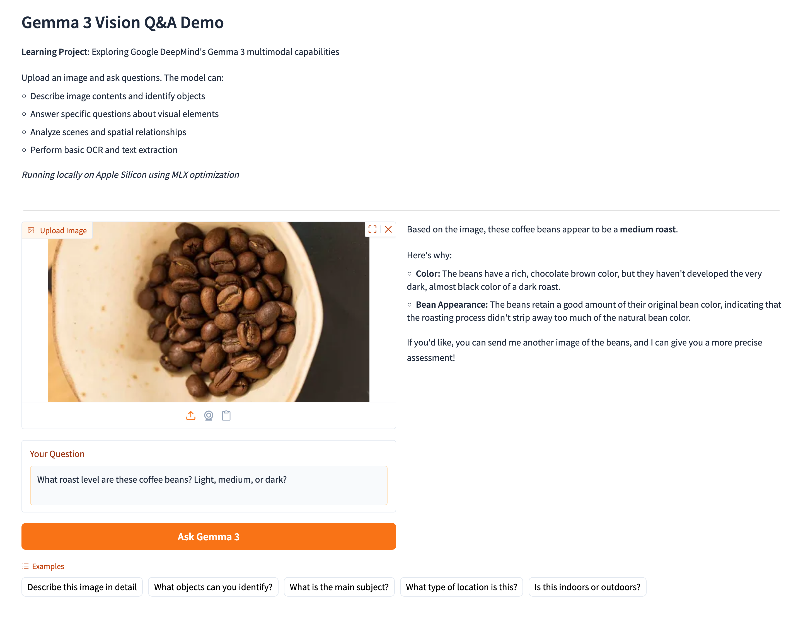

# Gemma 3 Vision Q&A Demo

[](https://www.python.org/downloads/)
[](https://github.com/astral-sh/uv)
[](https://github.com/indygreg/python-build-standalone)

**Learning Project**: Hands-on exploration of Google DeepMind's Gemma 3 multimodal model

Built with modern Python tooling (uv) to demonstrate:
- Large language model (LLM) deployment
- Multimodal AI (vision + language)
- MLX optimization for Apple Silicon
- Modern Python package management

## Quick Start
```bash
# Clone repository
git clone https://github.com/loresico/gemma3-vision-demo
cd gemma3-vision-demo

# Download python, install uv and then dependencies as in uv.lock
./setup.sh

# Activate the .venv
source .venv/bin/activate

# Run application
# Using installed command (recommended)
gemma3-demo

# Using module directly
python -m src.gemma3_vision_demo.app
```

## Demo Examples

*Demo showcases multimodal AI capabilities across two domains: location-based services (mapping/geographic understanding) and food & beverage analysis - both significant use cases for vision AI applications.*

### Example 1: Location Recognition & Recommendations


**Question:** "Can you recognize this city? What vegetarian dining options would you recommend?"

**Result:** Demonstrates practical application of multimodal AI for location-based services:
- Geographic recognition from visual map data
- Integration of visual analysis with knowledge retrieval
- Real-world use case for mapping and recommendation systems

*Demonstrates: Location identification, knowledge integration, practical Maps applications*

**Relevance to mapping products:** This type of query represents core functionality in location-based services - combining visual map understanding with contextual recommendations.

---

### Example 2: Coffee Bean Roast Analysis


**Question:** "What roast level are these coffee beans? Light, medium, or dark?"

**Result:** Gemma 3 correctly identified medium roast and provided detailed reasoning about:
- Color analysis (rich chocolate brown)
- Bean appearance and original color retention
- Understanding of roasting process impact

*Demonstrates: Visual analysis, domain reasoning, detailed explanation*

**Domain connection:** Food and beverage understanding is a major application area for vision AI in location services, from menu analysis to quality assessment.


## Technical Stack

- **Model**: Gemma 3 4B (8-bit quantized)
- **Framework**: MLX (Apple Silicon optimized)
- **Package Manager**: uv (fast Python package installer)
- **Interface**: Gradio
- **Python**: 3.10+

## Project Structure
```
gemma3-vision-demo/
├── .github/
│   └── workflows/
│       └── test.yml        # Test workflow
├── src/
│   └── gemma3_vision_demo/
│       ├── __init__.py
│       └── app.py          # Main application
├── tests/
│   ├── __init__.py
│   ├── conftest.py         # Pytest configuration
│   ├── test_app.py         # Application tests
│   └── README.md           # Test documentation
├── demo/
│   └── screenshots/
│       ├── zurich-map.png
│       └── coffee-beans-roast-analysis.png
├── .gitignore              # Standard .gitignore 
├── pyproject.toml          # Project configuration
├── uv.lock                 # Locked dependencies
├── pytest.ini              # Pytest settings
├── setup.sh                # Setup script
├── verify_python_version.sh # Python version check
├── README.md               # This file
├── CONTRIBUTING.md         # Contribution guidelines
├── TECHNICAL_NOTES.md      # Technical documentation
└── QUICK_REFERENCE.md      # Quick reference guide
```

## Known Issues

### mlx-vlm v0.3.5 Compatibility
This project includes a workaround for a bug in mlx-vlm v0.3.5 where the Gemma3 model's attention_mask handling causes a TypeError. The fix is applied automatically via a runtime patch in `app.py`. This workaround can be removed once the upstream library is updated.

## Limitations

This is a learning/demo project with:
- Local-only execution (no cloud deployment)
- Requires Apple Silicon Mac with 16GB+ RAM
- Model quantized to 8-bit for efficiency
- Not optimized for production use

## Future Exploration

- Fine-tune on domain-specific imagery (maps, satellite data)
- Implement streaming responses
- Add batch processing capabilities
- Explore larger Gemma variants (12B, 27B)
- Integration with mapping APIs

## Acknowledgments

- Google DeepMind for open-sourcing Gemma 3
- MLX team for Apple Silicon optimization
- Astral (uv developers) for modern Python tooling

## License

MIT - Demo/learning project

---

**Part of my active learning in ML/AI:**
- [Computer Vision: Image Super-Resolution](https://huggingface.co/spaces/loresico/gradio-super-resolution)
- [ML: Coffee Compass Predictor](https://huggingface.co/spaces/loresico/coffee-compass)
- [Python Templates with uv/Poetry](https://github.com/loresico/template-python-uv)